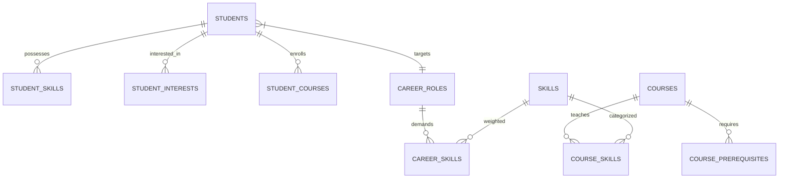

# 🎓 Intelligent Course Recommendation & Academic Path Planning System (EduPath AI)

[](https://www.python.org/)
[](https://flask.palletsprojects.com/)
[](https://scikit-learn.org/)
[](https://www.sqlite.org/)
[](https://powerbi.microsoft.com/)

---

## 📌 Project Overview

**EduPath AI** is a complete, portfolio-grade intelligent academic guidance platform designed to analyze a student's academic profile, current skills, interests, completed coursework, and target career goal to recommend personalized learning modules and dynamically generate a step-by-step prerequisite-aware learning roadmap.

Unlike static course listing sites, EduPath AI features a **multi-factor recommendation scoring engine**, **TF-IDF Cosine Similarity matching**, **prerequisite topological path planning**, **explainable AI recommendation rationale**, and an **exportable Power BI analytics dataset**.

---

## 🚀 Key Features

* **Intelligent Skill-Gap Analysis**: Compares a student's acquired skills against weighted skill requirements for 10+ industry career roles (e.g., *Data Analyst, Data Scientist, Cloud Engineer, Software Developer*).
* **Multi-Factor Weighted Scoring Engine**:
  $$\text{Score} = (0.40 \times \text{SkillGapMatch}) + (0.30 \times \text{CareerRelevance}) + (0.15 \times \text{InterestMatch}) + (0.10 \times \text{DifficultyFit}) + (0.05 \times \text{PrerequisiteCompat})$$
* **Content-Based Cosine Similarity**: Employs Scikit-learn TF-IDF vectorization across course descriptions, skills, categories, and student profile vectors.
* **Explainable AI Recommendations**: Every course recommendation provides 5 explicit bullet-point explanations detailing *why* it was selected.
* **Prerequisite Graph Path Planner**: Generates a dynamic, step-by-step academic roadmap flowchart using Directed Acyclic Graph (DAG) topological sorting so students never see advanced courses without completed prerequisites.
* **Dynamic Progress Tracking**: Marking a course as completed automatically credits the associated skills to the student's profile, triggering real-time recalculation of match scores, skill gaps, and career readiness percentages.
* **Power BI Dataset Export**: Features a dedicated endpoint (`/admin/export/powerbi`) generating `exports/powerbi_data.csv` for enterprise data analytics.
* **Modern Glassmorphic UI**: Ultra-sleek dark/light academic dashboard responsive design built with vanilla CSS, Chart.js visualizations, and interactive timeline components.

---

## 🛠️ Technology Stack

| Layer | Technology |
| :--- | :--- |
| **Frontend** | HTML5, CSS3 (Vanilla Glassmorphism Design System), JavaScript (ES6+), Chart.js |
| **Backend Framework** | Python 3.10+, Flask 3.0 |
| **Database** | SQLite3 (Relational Schema with Foreign Keys & Many-to-Many Tables) |
| **Machine Learning & Data Science** | Pandas, NumPy, Scikit-learn (TfidfVectorizer, Cosine Similarity) |
| **Data Analytics Export** | Power BI Compatible Flat CSV Exporter |

---

## 🏗️ Database Design & Schema

The system uses a normalized relational database schema (`database/schema.sql`):



### Relational Tables:
1. `students`: Stores profile data (`degree`, `branch`, `semester`, `cgpa`, `target_career_id`).
2. `courses`: Contains 52+ realistic courses (`course_code`, `category`, `difficulty`, `duration_weeks`, `estimated_hours`).
3. `skills`: Skill master table (`name`, `category`).
4. `career_roles`: Target job roles with category classifications.
5. `student_skills`: Junction table for student skill proficiencies.
6. `student_courses`: Tracks enrollment (`status`: `'in_progress'|'completed'|'saved'`, `progress_pct`).
7. `course_skills`: Maps skills taught by each course.
8. `course_prerequisites`: Self-referential prerequisite dependencies.
9. `career_skills`: Target role required skills with importance weights ($1.0 - 5.0$).
10. `recommendations`: Historical recommendation logs and breakdown JSON payloads.

---

## 🧮 Recommendation & Path Algorithm

### 1. Multi-Factor Score Computation (`recommendation/recommender.py`)
1. **Skill Gap Match (40%)**: Calculates coverage of missing skills required for target career.
2. **Career Relevance (30%)**: Evaluates total weight of skills taught relative to target job specifications.
3. **Interest Match (15%)**: Cosine similarity between student interest vector and course category/description.
4. **Difficulty Fit (10%)**: Matches semester level (Sem 1–3: Beginner, Sem 4–6: Intermediate, Sem 7–8: Advanced).
5. **Prerequisite Compatibility (5%)**: Checks whether student has satisfied prerequisite courses.

### 2. Topological Path Planner Algorithm (`recommendation/path_planner.py`)
1. Filters catalog down to courses teaching target career skills and their prerequisites.
2. Constructs an in-memory Dependency Graph $G=(V,E)$.
3. Computes topological sorting order while prioritizing completed courses $\to$ lower difficulty $\to$ shortest duration.
4. Assigns status badges: `Completed` (✓), `Recommended Next Step` (→), `Upcoming`, `Prerequisite Required` (🔒), and `Capstone Milestone`.

---

## 📊 Power BI Analytics Dataset

The platform generates `exports/powerbi_data.csv` containing flattened fields:
* `Student_ID`, `Student_Name`, `Degree`, `Branch`, `Semester`, `CGPA`
* `Target_Career_Goal`
* `Course_Code`, `Course_Name`, `Course_Category`, `Course_Difficulty`
* `Recommendation_Match_Score`
* `Course_Completion_Status`, `Course_Progress_Pct`
* `Career_Readiness_Pct`

### Recommended Power BI Visualizations:
1. **KPI Cards**: Total Students, Average Career Readiness, Total Courses, Most Recommended Course.
2. **Career Goal Distribution**: Donut chart of student target roles.
3. **Skill Gap Heatmap**: Matrix of missing skills by degree branch.
4. **Course Completion Rate**: Stacked bar chart by course difficulty.

---

## 📂 Project Structure

```
EduPath Ai/
├── app.py                      # Primary Flask server & REST API
├── requirements.txt            # Python dependencies
├── README.md                   # System documentation
│
├── database/
│   ├── database.db             # SQLite database
│   ├── schema.sql              # Relational DDL schema
│   └── seed_data.py            # Seed script populating 52 courses & sample student data
│
├── data/                       # CSV reference datasets
│   ├── courses.csv
│   ├── skills.csv
│   └── career_roles.csv
│
├── recommendation/             # Modular ML & Recommendation Engine
│   ├── __init__.py
│   ├── recommender.py          # TF-IDF Cosine Similarity & Weighted Scoring
│   ├── skill_gap.py            # Skill-gap & readiness computations
│   ├── career_match.py         # Career profile scoring & skill weighting
│   └── path_planner.py        # Topological path planning & prerequisite DAG logic
│
├── templates/                  # Jinja2 modern UI views
│   ├── base.html               # Main glassmorphic sidebar layout
│   ├── index.html / login.html # Authentication views
│   ├── register.html           # Profile creation view
│   ├── dashboard.html          # Main student dashboard with Chart.js
│   ├── profile.html            # Profile & skills setup form
│   ├── recommendations.html    # Recommendations page with explainability modal
│   ├── academic_path.html     # Dynamic visual roadmap timeline
│   ├── courses.html            # Catalog search & multi-filtering
│   ├── course_details.html     # Course info & progress controls
│   ├── progress.html           # Enrollment tracker
│   ├── career_analysis.html    # Deep-dive career gap visualizer
│   └── admin.html             # Admin panel & Power BI exporter
│
├── static/
│   ├── css/
│   │   └── style.css           # Custom CSS design system
│   └── js/
│       ├── main.js             # Global fetch helpers & toasts
│       ├── dashboard.js        # Chart.js initialization
│       └── recommendations.js  # Explanation modal interactivity
│
└── exports/
    └── powerbi_data.csv        # Generated Power BI CSV dataset
```

---

## 💻 Installation & How to Run

### Prerequisites
* Python 3.10 or higher
* Git

### Step-by-Step Setup

1. **Clone or Navigate to the Workspace Directory**:
   ```bash
   cd "c:/Users/bamad/OneDrive/Desktop/EduPath Ai"
   ```

2. **Install Required Python Dependencies**:
   ```bash
   pip install -r requirements.txt
   ```

3. **Seed Database with 52 Courses, Skills, and Sample Profiles**:
   ```bash
   python database/seed_data.py
   ```

4. **Launch the Flask Development Server**:
   ```bash
   python app.py
   ```

5. **Access the Application**:
   Open your browser and navigate to:
   ```
   http://127.0.0.1:5000
   ```

---

## 🔑 Demo Login Credentials

| Role | Email | Password | Features |
| :--- | :--- | :--- | :--- |
| **Student** | `alex.mercer@univ.edu` | `password123` | Dashboard, Recommendations, Academic Path, Skill Gap |
| **Admin** | `admin@edupath.ai` | `admin123` | Admin Panel, Course CRUD, Power BI Export Engine |

---

## 🔮 Future Machine Learning Enhancements

The codebase architecture is designed to support upcoming ML extensions:
* **Collaborative Filtering**: User-based and item-based collaborative filtering using matrix factorization (SVD).
* **KNN Student Clustering**: K-Nearest Neighbors grouping students by academic performance and learning pace.
* **Career Path Prediction**: Random Forest / Gradient Boosting models predicting career outcome probabilities.

---

## 📜 License

Distributed under the MIT License. Built for educational and portfolio presentation purposes.
